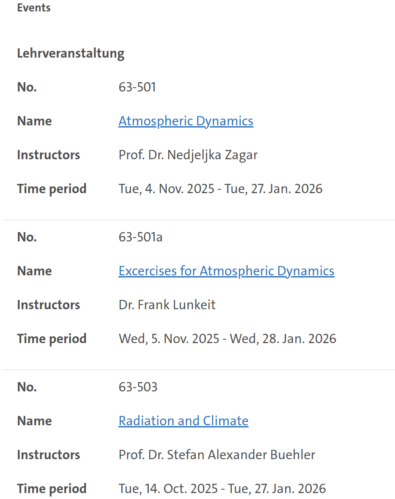

# Study-Planner

## Project Description
This project aims to create study planner for students. It will allow students to plan their schedules and later view it in an intuitive graphical user interface.  There are also plans to scrape websites with classes to automatically populate the planner using web scraping. Also, we can create a room timetable as well for the Geomatikum.

## Project Scope and Goals
1. Parse a user-created csv file and use the data to create a structured timetable.
2. Create the schedule from user-generated input.
3. Scrape UHH website to create the timetable automatically.
4. Create a timetable for specific classrooms to determine their availability for students who wish to use them for studying.

## 1. Using the CSV format
In this case, the user will populate a csv file with the information for their courses. This csv file will then be used to create a timetable.

## 2. Using a link from STiNE
In this case, the user will provide a link to the page which contains their courses. The get to this page, students must log into STiNE, navigate to Studying and click on Courses. This hyperlink will then be the input for the study planner. A screenshot of this page is provided below.

In the future, we can likely automate the fetching of this link.

### CSV Structure
Each row in the CSV file represents one scheduled course session. The required columns

| Column              | Description                                  |
| ------------------- |----------------------------------------------|
| **course_name**     | The name/title of the course                 |
| **credits**         | Number of credit hours                       |
| **day**             | Start day (Sunday, Monday, ... , Saturday)   |
| **start_time**      | Start time in 24 hour format (e.g., `18:00`) |
| **duration**        | Duration (TimeDelta)                         |
| **room**            | Room or lecture hall                         |
| **lecturer**        | Instructor of the course                     |

### Timetable Display

We plan to support:

1. Static Timetable (Matplotlib)
   - Clean weekly timetable image
   - Minimal details for clarity
   - Good for exporting or printing

2. Interactive Timetable (Plotly)
   - Hover tooltips with additional course information
   - Potential zooming or filtering (e.g., by day, room, or teacher)

### Ideas
- [] Create a timetable class which can be used to retrieve specific information and do specific things.
- [] Add a table to enclose the days on the timetable for aesthetics.